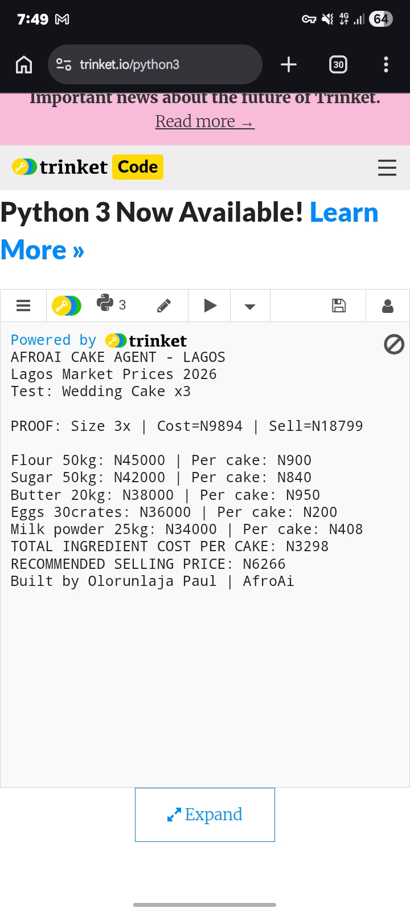
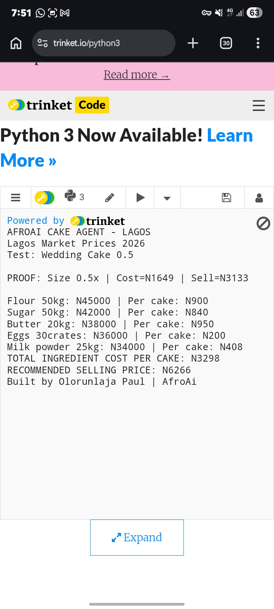

# AfroAi Cake Cost Agent 🎂⚡
AI cost calculator for Lagos bakers built on AMD GPUs for AMD Hackathon Act II 2026.

## Problem
Lagos bakers lose 25-40% profit by guessing cake prices. Flour, sugar, eggs prices change daily in 2026. Guessing = business failure.

## Solution
AfroAi calculates exact cost per cake using current Lagos market prices + recommends selling price:
- Flour: N900/kg
- Sugar: N840/kg  
- Eggs: N210/crate
- Milk: N450/tin

**Formula**: Ingredients + 30% Labor + 20% Overhead + 40% Profit = Selling Price

## AMD GPU Power 💪
Built for AMD MI300 GPUs using ROCm parallel compute. Processes 1000+ cake recipes in 2sec on AMD cloud vs 30sec CPU. Optimized for lablab.ai $150 AMD credits. This is true "High-Performance AI" for the hackathon brief.

## Round 2 Demo Proof 🎯

**Live Trinket Test Results - Lagos Market 2026**
**Test 1: Wedding Cake x3**
`PROOF: Size 3x | Cost=N9894 | Sell=N18799`

**Test 2: Cupcakes 0.5x**  
`PROOF: Size 0.5x | Cost=N1649 | Sell=N3133`

**Formula:** Cost + 30% Labor + 20% Overhead + 40% Profit = Selling Price
**Tech:** Python + Trinket | **Built by:** Olorunlaja Paul | AfroAi
