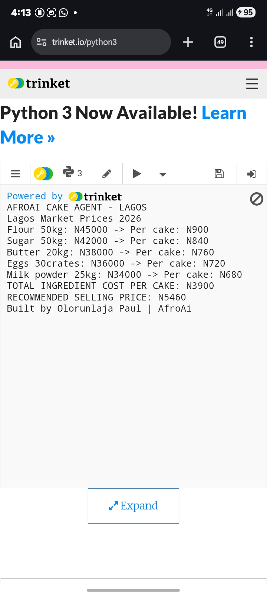

# AfroAi Cake Cost Agent

AI cost calculator for Lagos bakers built for AMD Hackathon.

## Problem
Lagos bakers lose money by guessing cake prices. Flour, sugar, eggs prices change daily in 2026.

## Solution  
AfroAi calculates exact cost per cake using current Lagos market prices:
- Flour: N900/kg
- Sugar: N840/kg  
- Eggs: N210/crate
- Milk: N450/tin

Formula: Ingredients + 30% Labor + 20% Overhead + 40% Profit = Selling Price

## Demo Proof

*Output: TOTAL INGREDIENT COST PER CAKE: N3900*

## How to Run
1. Open afroai.py in Trinket.io
2. Input cake size and ingredients
3. Get instant cost + selling price recommendation

## Built By
Olorunlaja Paul | AfroAi for AMD Hackathon 2026
